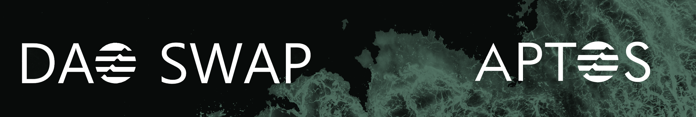

# Aptos-DaoSwap

Build the best NFT community with DaoSwap

# What is DaoSwap?

TL;DR answer:  
DaoSwap is a candy machine (NFT launch tool) with an NFT swap liquidity pool inspired by SudoSwap  

DaoSwap is an NFT launch tool that plans to solve 3 current NFT community problems

## 1. centralized fund management
When community fund goes directly to the deployer's wallet, the project can be easily rugged by some malicious creators. 
Instead in Daoswap, NFT sales and rarity fund will be held in a swap pool as a buyback guarantee. 
Holders will always have exit liquidity and the exit price will gradually go up when more holders come in and more project incomes get generated. 
Project deployers can design how they get paid (weekly paid from the pool or paid based on volume/floor price, etc.) 
Transparent, decentralized, smart contract guarded and beautiful way of fund management:) 

## 2. weak incentives for early stakeholders
Currently, early stakeholders can only get OGs/WLs and wait a long time before the final mint. 
This is tedious and boring! 
In Daoswap, early stakeholders can get their NFTs from day 1. 
With more people knowing and buying the project's NFTs, the exit price will rise. 
Quick profits for degen flippers and instant feedback for diamond hands. 

## 3. too much focus on marketing, too little on building
In the bear market, the biggest challenge for an NFT project is attracting enough launch minters. 
If the launch performs very badly, the project will face a sudden death. 
As a result, projects nowadays are focusing too much on marketing and gathering people. 
Projects often don't build anything before sold-out and are not incentivized to build more because of sold-out. 
Sad results come, like a rug or a soft-rug. 
In Daoswap, there's no pressure of sold-out. 
Projects can sell nfts from day 1, and the more you build, the more buyers come, then the better exit price for early holders. 
Make your project in a more linear and manageable way. 